# HACK THE FEED HACKATHON

## Title and Introduction

This report provides a comprehensive analysis of all four datasets in the `Hack the Feed` competition.
It outlines the analysis's scope and objectives, along with the insights and recommendations derived from our work.
We conducted consistent analyses for each dataset, addressing crucial questions regarding:

1. Impressions
2. Reach
3. Click-Through Rate

All datasets were sourced from the competition's webpage, accessible [here](https://portfolio.diceytech.co.uk/project-opportunity/1692893137471x831086163701530600).
We downloaded the .csv files and conveniently renamed them for easy access within our directory.

## Data pre-processing

Upon examination, all datasets were found to share a uniform structure, consisting of an identical number of columns and column names.

Building on this observation, we utilized the pandas library to open each dataset.
A [Python script](../src/clean_data.py) was crafted to streamline and format the data for more straightforward analysis.
The script accomplishes the following tasks:

1. Separates the `Date` column into `Date` and `Time` columns.
2. Removes selected columns, such as "Post Type," "Network," "Post ID," and "Profile," as they are unnecessary for our analysis.
3. Eliminates all columns with no values (those containing NaN values).
4. Introduces a new column called "Time Period" to categorize post times into "morning," "afternoon," and "evening."
5. Sets the `Date` column as the dataframe's index.
6. Sorts the `Date` column, arranging entries from the earliest date to the latest.
7. Converts numerical columns to decimal numbers (floating-point) to facilitate computations.

## Data Analysis
### Dataset 1 - Facebook

We initiated the data preprocessing by executing it through the predefined `clean_data` function.
This transformation led to a reduction in the dataset, condensing it from 148 columns to 98 columns.
The rationale behind these column drops is elucidated in the data preprocessing sub-section, accessible [above](#data-pre-processing).

In the context of the Facebook dataset analysis, we posed and addressed the following questions:

- Which type of content garners the highest number of impressions?
- What is the trend in impressions over the years?
- When is the optimal time for posting on Facebook?
- Which type of content boasts the widest appeal?
- How frequently do users engage by clicking on shared links?

To tackle these questions, we created a subset of the cleaned dataset, denoted as `valid_impressions`, which exclusively contains rows with impressions above zero.

#### Content Type and Impressions

In response to the first query, we grouped the `valid_impressions` dataframe by `Content Type` and computed the mean `Impressions`.
Subsequently, we visualized these findings through a bar chart, depicted as follows:

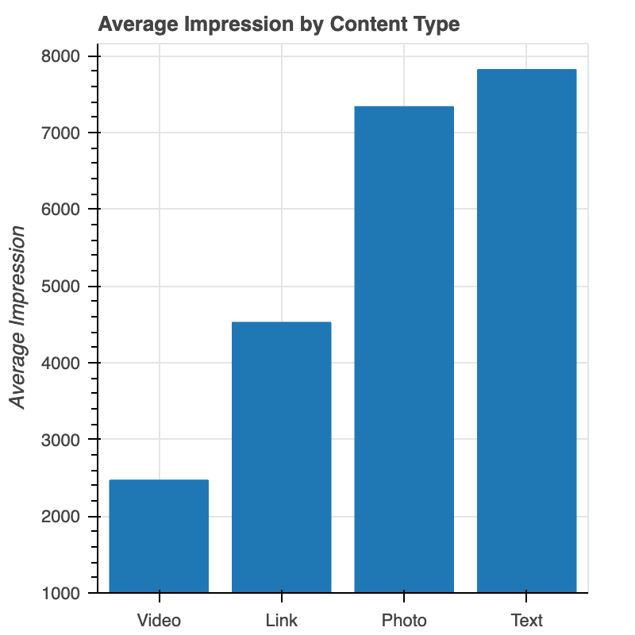

**Findings:** This analysis reveals that `Texts` and `Photos` emerge as the primary drivers of impressions on Facebook.

#### Trend of Impressions Over the Years

Regarding the second inquiry, we computed the average impressions for each month throughout the years and visualized these trends using a line graph:

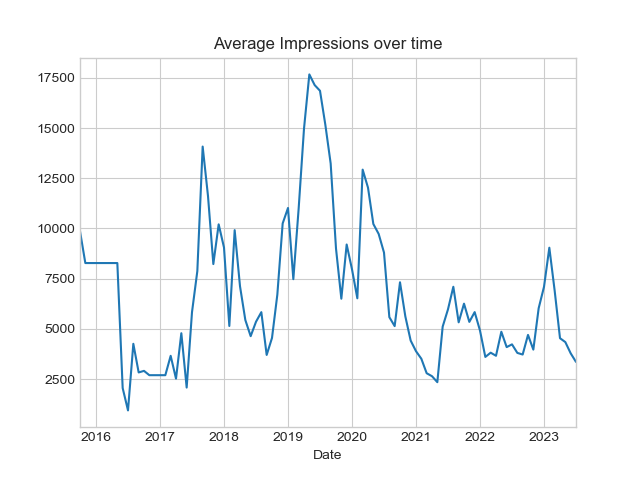

**Findings:** A quick glance at the data indicates that the average impressions on Facebook posts reached their zenith around 2019 but have been steadily declining since.

#### Best Time to Post on Facebook

As for the third question, we grouped the `valid_impressions` dataframe by both `Content Type` and `Time Period`, subsequently computing the average `Reach` of the posts.
It is noteworthy to distinguish that the `Reach` metric quantifies the number of unique users who viewed the post, setting it apart from the `Impressions` metric, which gauges the number of non-unique instances a post was seen.

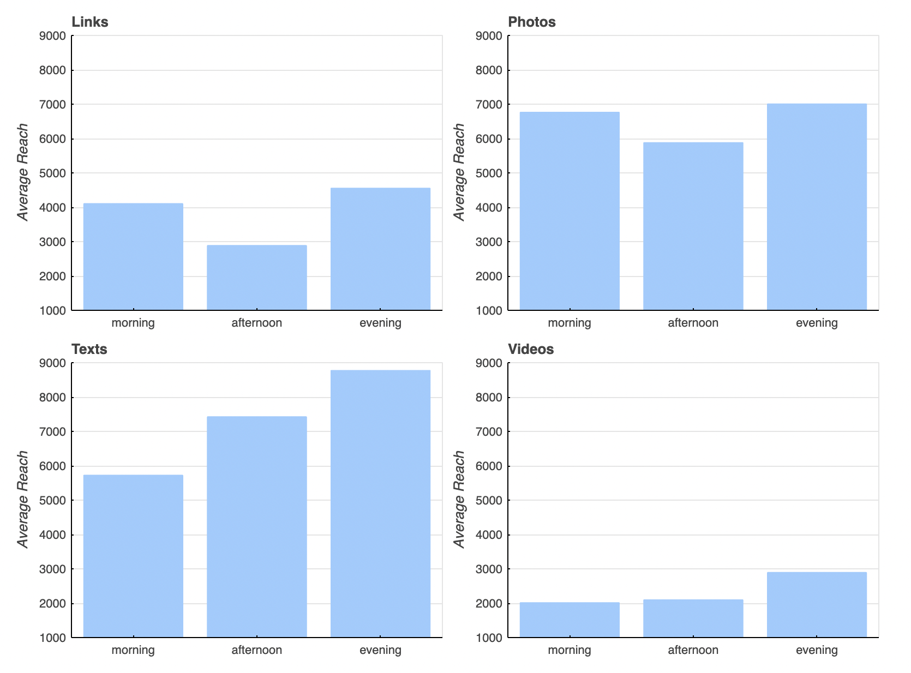

**Findings:** The bar chart illustrating the `Reach` metric provides insights into the time periods during which each content type can maximize its reach.

#### Content Type with the Widest Appeal

In contrast, the `Organic Reach` metric, which delineates the count of unique users who viewed the post without any paid promotion, offers a distinct perspective.
To address the fourth question and gain a comprehensive understanding of the content type with the broadest appeal, we can visualize this metric by plotting a bar chart juxtaposing `Content Type` against the average `Organic Reach`.

This comparative analysis helps pinpoint which content types resonate most organically with the audience, shedding light on their broad appeal.

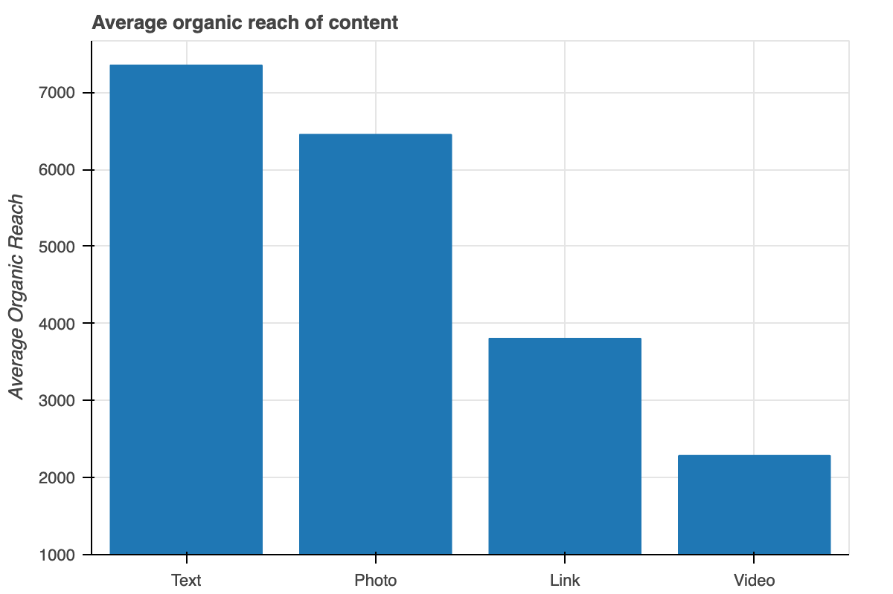

#### User Engagement with Shared Links

To address the fifth and final question, we conducted an in-depth analysis of user engagement with shared links.
The process entailed creating a subset of the `valid_impressions` dataframe, which exclusively contains entries with values for both `Linked Content` and `Click-Through Rate` (CTR).
This filtering criterion ensures that our analysis exclusively pertains to CTR for posts that incorporate links.
We assigned this filtered dataframe the name `linked`.

Subsequently, we organized the `linked` dataframe by content type and computed the mean CTR for each content type.
The resulting values were then visualized in a plot, providing the following insights:

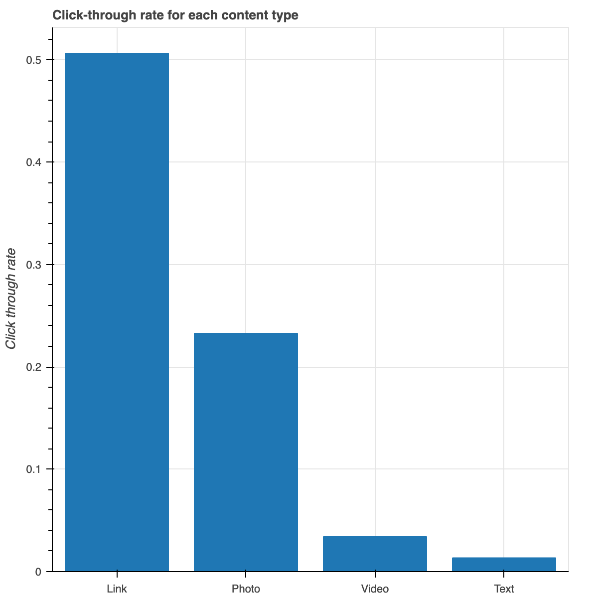

**Findings:** This plot offers valuable insights into how users engage with shared links, facilitating a comprehensive understanding of CTR across different content types.

### Dataset 2 - Instagram

In the context of the Instagram dataset analysis, we posed and addressed the following questions:

1. What type of content generates the most impressions?
2. What is the trend of impressions over the years?
3. When is the best time to post on Instagram?
4. What type of content has the broadest appeal?
5. What type of contents generate the most authentic engagements?

#### Content Type and Impressions

**Methodology:** To address the first question, we followed a similar methodology as in the Facebook analysis.
We explored the relationship between content types (e.g., text, photos, videos) and impressions on Instagram.
We used the `Impressions` metric as our primary indicator of content performance.

**Findings:**

A cursory glance at the bar chart shows that all content types share similar impressions metric.
It would have been instructive to perform some more analysis to see if these differences are significant but we were constrained by the approaching deadline.

#### Trend of Impressions Over the Years

**Methodology:** For the second question, we conducted a longitudinal analysis of impressions to identify trends over the years.
We used the same approach as for the Facebook dataset.

**Findings:**

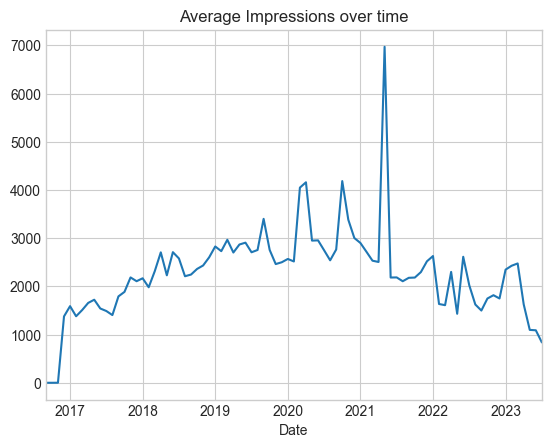

Just like the facebook dataset, the impressions seem to have dropped off post 2021.

#### Best Time to Post on Instagram

**Methodology:** To determine the optimal posting times on Instagram, we employed a similar approach to the Facebook analysis.

**FIndings**

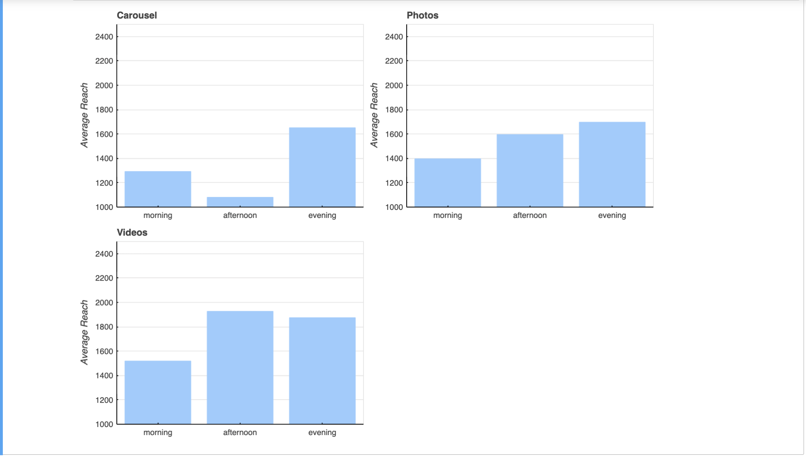

The bar chart illustrating the `Reach` metric provides insights into the time periods during which each content type can maximize its reach.

#### Content Type with the Broadest Appeal

**Methodology:** We use the same process as the facebook dataset as well to  visualize this metric by plotting a bar chart juxtaposing `Content Type` against the average `Organic Reach`.

This comparative analysis helps pinpoint which content types resonate most organically with the audience, shedding light on their broad appeal.

**Findings:**

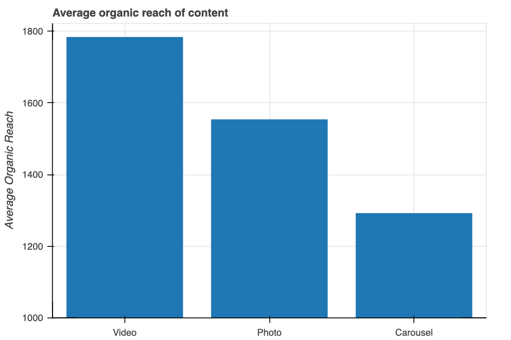

A glance at this chart reveals that videos have the most appeal as a content type on Instagram.

#### Content Type with the most Authentic Engagement

**Methodology:** Similar to the `Organic Reach` metric, we also analyzed the `Organic Impression` metric to give us insight as to the type of content that generate the most authentic engagements.
We use a similar method as with the `Organic Reach` metric but now we plot the `Content Type` against `Organic Impressions`.

**FIndings:**

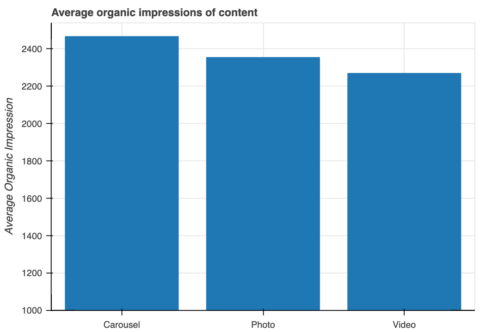

From the findings, it is obvious that old users enagage more with Carousels.
This quite different from what appeals to new users as gleaned from the `Organic Reach` metric.

### Dataset 3 - LinkedIn

In the context of the LinkedIn dataset analysis, we posed and addressed the following questions:

1. What type of content generates the most impressions?
2. What is the trend of impressions over the years?
3. When is the best time to post on LinkedIn?
4. What type of contents generate the most authentic engagements?

#### Content Type and Impressions

**Methodology:** To address the first question, we followed a similar methodology as in the Facebook analysis.
We explored the relationship between content types (e.g., text, photos, videos) and impressions on LinkedIn.
We used the `Impressions` metric as our primary indicator of content performance.

**Findings:**

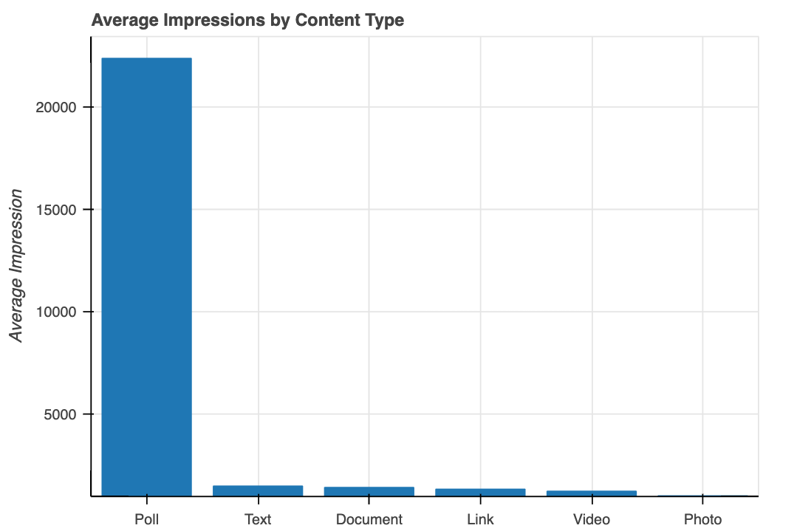

The chart shows a disproportionate amount of engagement with Polls on LinkedIn.
This is very instructive as it can guide decision making as to which content type can keep users engaged with the product.

#### Trend of Impressions Over the Years

**Methodology:** For the second question, we conducted a longitudinal analysis of impressions to identify trends over the years.
We used the same approach as for the Facebook dataset.

**Findings:**

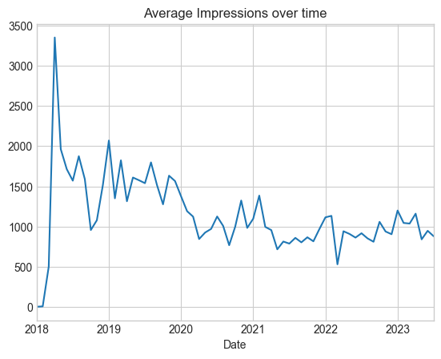

Similar to all other datasets, the rate of impressions on all type of content seem to have dropped steadily from its peak in 2018-2019.
#### Best Time to Post on LinkedIn

**Methodology:** To determine the optimal posting times on LinkedIn, we employed a similar approach to the Facebook analysis.

**FIndings**

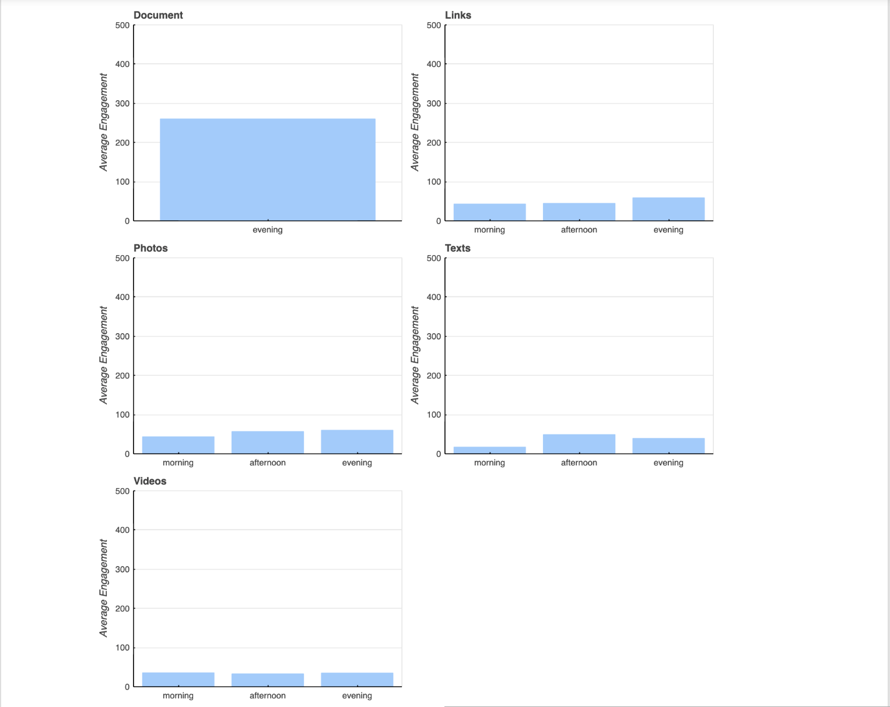

In this plot grid, we see a single row where the content type is a `Document` that generate higher than average engagements compared to other types.

#### Content Type with the most Authentic Engagement

**Methodology:** Similar to the `Organic Reach` metric, we also analyzed the `Organic Impression` metric to give us insight as to the type of content that generate the most authentic engagements.
We use a similar method as with the `Organic Reach` metric but now we plot the `Content Type` against `Organic Impressions`.

**FIndings:**

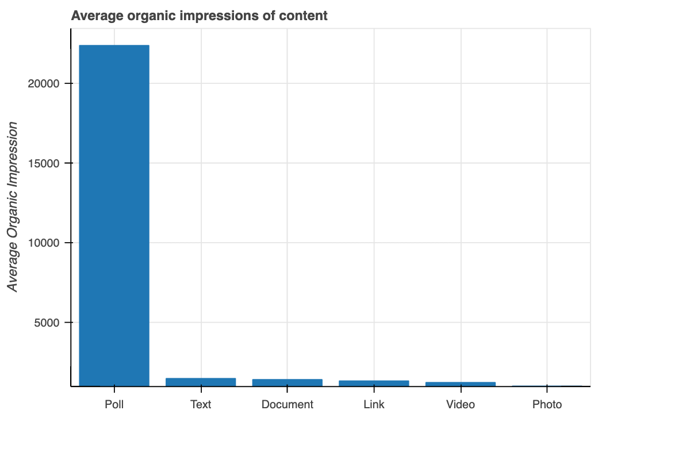

As is evident by the `Impressions` column, the `Poll` content type also has the most authentic engagement on Linkedin.

### Dataset 4 - Twitter

The twitter dataset analysis encompasses the following key questions:

1. What type of content generates the most impressions?
2. What is the trend of impressions over the years?
3. When is the best time to post on Twitter?
4. How often do users click on shared links?

It is instructive to mention that after using our `clean_data` function to pre-process the data, the columns went down from 147 to 34 columns.
This reveals a large swathe of empty columns in the dataset.

#### Content Type and Impressions

**Methodology:** To address the first question, we followed a similar methodology as in the Facebook analysis.
We explored the relationship between content types (e.g., text, photos, videos) and impressions on Twitter.
We used the `Impressions` metric as our primary indicator of content performance.

**Findings:**

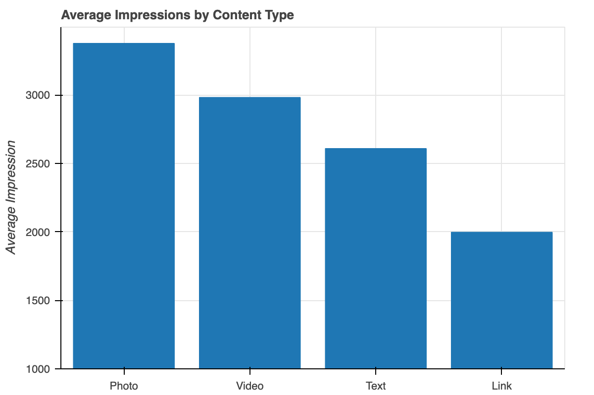

Our analysis of impression trends indicated that `Photos` and `Videos` generate the most impressions on twitter.

#### Trend of Impressions Over the Years

**Methodology:** For the second question, we conducted a longitudinal analysis of impressions to identify trends over the years.
We utilized a time-based approach to visualize the change in impressions over different time periods.

**Findings:**

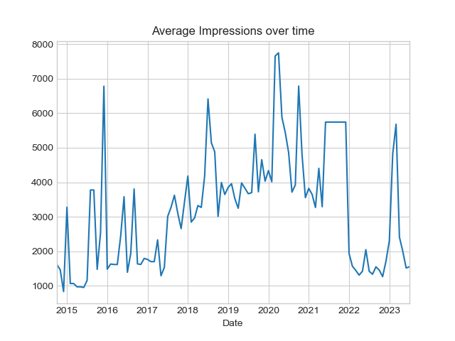

#### Best Time to Post on Twitter

**Methodology:** To determine the optimal posting times on Twitter, we employed a similar approach to the Facebook analysis.
However, instead of using the `Reach` column, we used the `Potential Reach` column.
This is because the `Reach` column was empty.
This also means that the results from using the `Potential Reach` column cannot be justified as it varies a great deal from the actual `Impressions` data.

**Findings:**

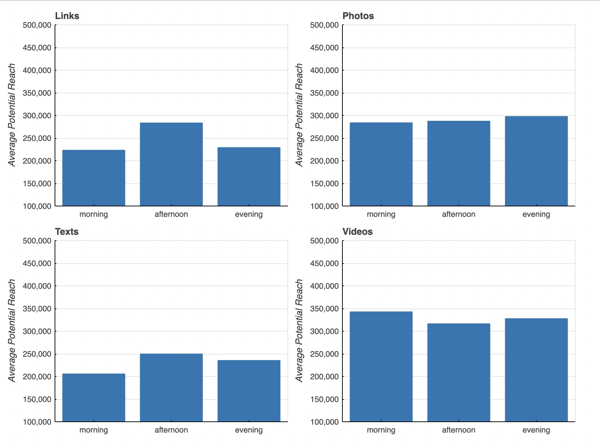

#### User Engagement with Shared Links

**Methodology:** Addressing the fourth question involved an analysis of user behavior concerning shared links on Twitter.
We focused on the `Click-Through Rate` (CTR) metric, which measures the frequency of users clicking on shared links.

**Findings:**

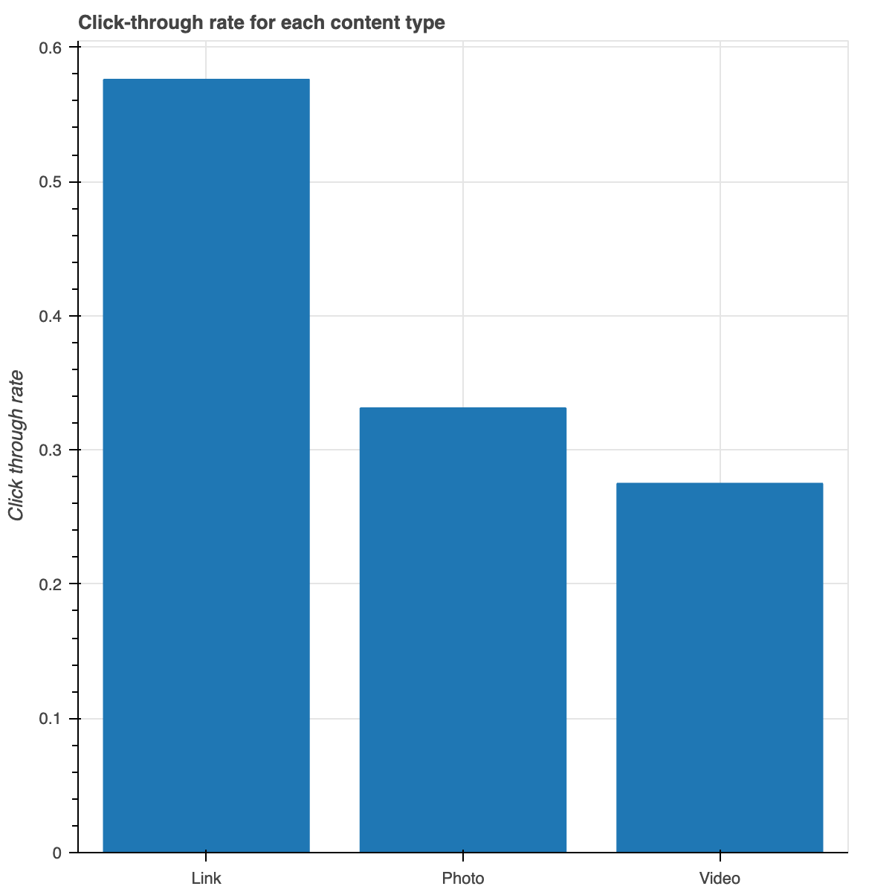

One standout thing to note here is that the `Text` content type is absent from the bar chart.
This is because we discovered 19 rows with the `Text` content type in which there are values for the CTR but no corresponding links attached to the posts.
We could not justify how the CTR is determined for posts that have no links attached to them.

## Recommendations

1. In order to drive new user engagement on posts, we recommend tailoring the content type and time of posting to coincide with the highest `Impressions`, `Reach` and `Engagement`
2. We also recommend further investigations into the pattern and quality of content post 2019.
3. We also noticed that the same type of posts are posted across all the platforms.
It would be more efficient to focus on the type of content that generates the most engaement for each platform.
